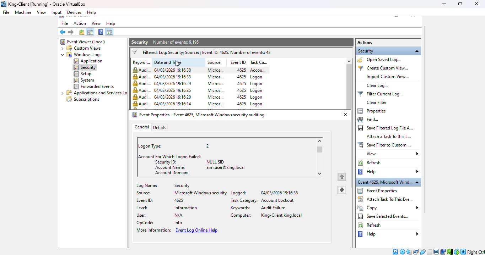
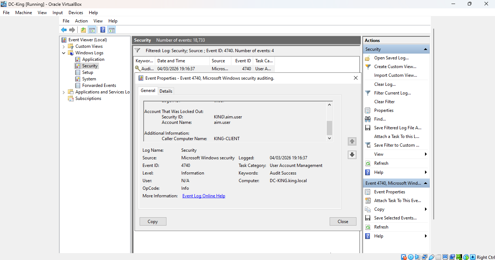

# Incident Casebook: Brute-Force Investigation
**Analyst:** Kingsley Eboh
**Date:** 04 March 2026
**Severity:** Medium
**Status:** Resolved
**Environment:** king.local — Isolated Active Directory Home Lab

---

## Incident Summary

A brute-force attack was detected against a domain user account in the king.local environment. Five consecutive failed logon attempts were recorded against `aim.user@king.local` from the workstation **King-Client.king.local** within a 24-second window. The domain's account lockout policy triggered automatically after the fifth failed attempt, preventing further access attempts. No successful logon was recorded. The incident was identified through routine Security event log monitoring on the Domain Controller.

---

## Incident Description

| Field | Detail |
|---|---|
| Incident Type | Brute-Force Authentication Attack |
| Target Account | aim.user@king.local |
| Source Workstation | King-Client.king.local |
| Logon Type | 2 (Interactive) |
| Failed Attempts | 5 within 24 seconds |
| Detection Method | Windows Security Event Log — Event ID 4625 |
| Lockout Confirmed | Yes — Event ID 4740 at 19:16:38 |

---

## Investigation

**Event Identification**
- Security logs on the Domain Controller (DC-KING) were filtered for Event ID 4625 (Failed Logon)
- Five failed logon attempts were identified targeting `aim.user@king.local` from King-Client.king.local
- All attempts used Logon Type 2, confirming interactive logon from the local workstation
- Event ID 4740 (Account Locked Out) was identified at 19:16:38, confirming the lockout policy was triggered

**Data Extraction**

| Field | Detail |
|---|---|
| Target Account | aim.user@king.local |
| Source Workstation | King-Client.king.local |
| Logon Type | 2 (Interactive) |
| Failed Attempts | 5 within 24 seconds |
| Account Locked Out | Yes |
| Successful Logon | No |

---

## Timeline

| Time | Event ID | Description |
|---|---|---|
| 19:16:14 | 4625 | First failed logon attempt against aim.user |
| 19:16:20 | 4625 | Second failed logon attempt against aim.user |
| 19:16:25 | 4625 | Third failed logon attempt against aim.user |
| 19:16:29 | 4625 | Fourth failed logon attempt against aim.user |
| 19:16:33 | 4625 | Fifth failed logon attempt against aim.user |
| 19:16:38 | 4740 | Account aim.user locked out — lockout policy triggered |

---

## Detection Coverage

| Event ID | Category | Description | Finding |
|---|---|---|---|
| 4625 | Authentication | Failed Logon | Five consecutive failed attempts against aim.user from King-Client |
| 4740 | Account | Account Locked Out | Lockout policy triggered after fifth failed attempt at 19:16:38 |

---

## Analysis

- Only one account was targeted, indicating a focused and deliberate brute-force attempt rather than a broad password spray
- All attempts originated from a single workstation via Logon Type 2 (Interactive), confirming the activity was carried out directly at or from King-Client.king.local
- The 24-second window across five attempts indicates a rapid, manual or scripted credential attack
- The domain lockout policy — configured at a 5-attempt threshold — responded as expected, automatically blocking further attempts
- No successful logon was recorded at any point during or after the attack window, confirming the account was not compromised
- Had no lockout policy been in place, an attacker could have continued credential attempts indefinitely until access was gained

---

## MITRE ATT&CK Mapping

| Field | Detail |
|---|---|
| Tactic | Credential Access |
| Technique | T1110 — Brute Force |
| Sub-technique | T1110.001 — Password Guessing |

---

## Impact Assessment

| Field | Detail |
|---|---|
| Risk Level | Medium |
| Outcome | No compromise — account locked out before successful authentication |
| Potential Impact | Unauthorised access to a domain user account and associated resources |
| Mitigating Control | Account lockout policy (5-attempt threshold, 15-minute duration) |

---

## Containment & Recommendations

**Immediate Actions**
1. Reset the password for `aim.user@king.local`
2. Unlock the account once the password has been reset
3. Inspect King-Client.king.local for signs of compromise or unauthorised access

**Longer-Term Recommendations**
1. Configure SIEM alerting for clusters of Event ID 4625 across domain accounts
2. Monitor for similar patterns targeting other accounts — a single account focus may indicate targeted reconnaissance
3. Review whether Logon Type 2 access from King-Client is expected behaviour for aim.user
4. Educate users on strong password practices and the importance of reporting suspicious activity

---

## Lessons Learned

- Account lockout policies are a critical and effective control against brute-force attacks — without this policy, the attack window would have remained open indefinitely
- Logon Type 2 (Interactive) in the event log immediately narrowed the investigation to physical or local workstation access, which in a real environment would significantly focus the response
- Event ID 4625 alone does not confirm a brute-force attack — it is the correlation with Event ID 4740 that confirms the lockout threshold was breached and provides the complete picture
- In a production SOC environment, five failed logon attempts within 24 seconds against a single account would constitute a high-priority alert requiring immediate triage

---

## Evidence

### Failed Logon Attempts — Event ID 4625

### Account Lockout — Event ID 4740

---

*This incident was simulated in an isolated Active Directory home lab environment with no connection to production systems. Produced for portfolio and educational purposes.*
